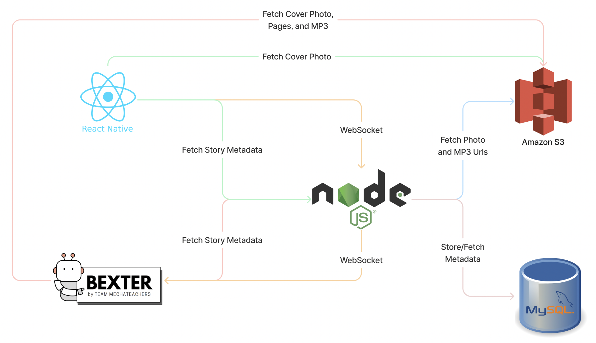

# Bexter

Bexter is a supplementary tool that mimics a session with a Speech Language Pathologist (SLP). It is designed to help non-verbal children with autism spectrum disorder learn communicate with others. Bexter increases exposure to an Augmentative and Alternative Communication (AAC) board. It is a take home solution that teaches the use of AAC boards through modeling. Bexter reads aloud a children's story while modeling the proper use of any AAC board. It is designed to be used in a supervised environment. Each story has key learning outcomes focusing on the repetition of certain symbols. The variety of stories allows for a balance of repetition and adaptation.

